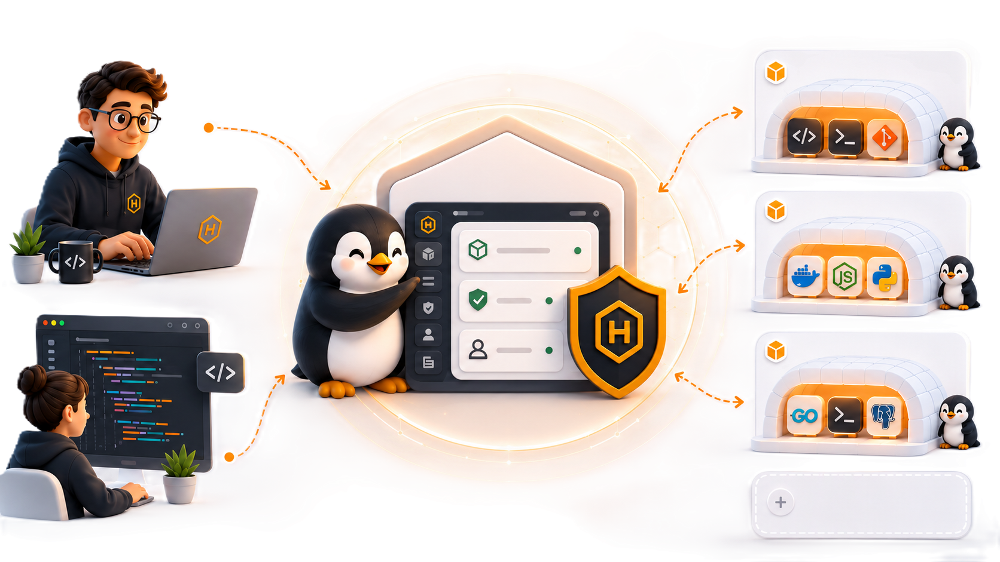
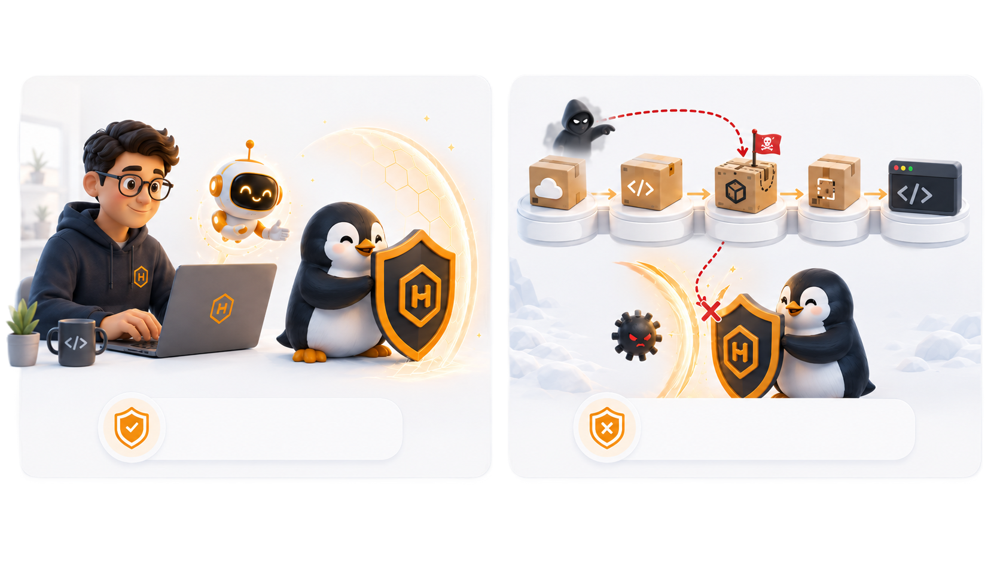
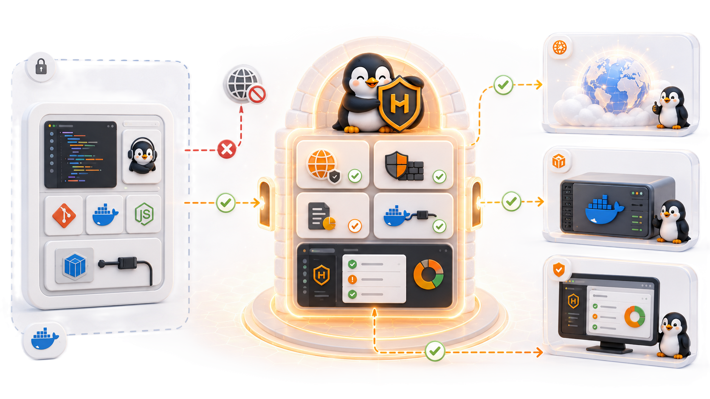

# Huddle

<p align="center">
  <a href="LICENSE"></a>
  <a href="CONTRIBUTING.md"></a>
  
</p>

## Wat is Huddle?

Huddle is een security gateway die devcontainers afschermt van het externe netwerk via een per-domein firewall. Elke devcontainer draait in een DMZ: al het uitgaande verkeer gaat verplicht door Huddle, en alleen domeinen op de allowlist worden doorgelaten. Operators beheren firewall-regels, Docker-toegang en netwerk-logs via een centrale web-UI.

Je IDE (JetBrains of VS Code) voelt normaal aan, maar code, tools en AI draaien in een afgeschermde omgeving. De uitvoering zit geïsoleerd; het portaal houdt controle over wat er in- en uitgaat.

<p align="center">
  
</p>

## Waarom Huddle?

Huddle adresseert twee grote risico's van moderne, AI-ondersteunde ontwikkeling:

- **Veilig developen *mét* AI** — AI moet kunnen helpen, maar niet ongecontroleerd je systeem kunnen aanpassen of data kunnen exfiltreren.
- **Veilig developen *tégen* AI-versterkte aanvallen** — supply-chain attacks worden slimmer, sneller en meerstaps. Huddle vangt uitgaand verkeer af en blokkeert wat niet expliciet is toegestaan.

<p align="center">
  
</p>

## Architectuur

```
Devcontainer
  └─ HTTP/HTTPS-verkeer → Huddle proxy (poort 80)
       └─ rules engine → allow / deny / request
  └─ Docker socket → /tmp/dc-sockets/<naam>.sock (per-container proxy)
       └─ label-isolatie + time-limited grant check

Browser
  └─ Angular SPA (poort 3000) + WebSocket live push
       └─ Fastify REST API (/api/...)
```

Twee servers draaien in hetzelfde proces:

| Server | Poort | Doel |
|--------|-------|------|
| HTTP proxy | 80 | Doorsturen/onderscheppen van alle uitgaande containertraffic |
| API + UI | 3000 | REST API, Angular frontend, WebSocket push |

<p align="center">
  
</p>

### Drie veiligheidsprincipes

| Principe | Wat het betekent |
|----------|------------------|
| **Geen direct internet** | Verkeer loopt via de Huddle Gateway met firewall-approvals — geen enkele container praat rechtstreeks met het externe netwerk. |
| **Docker proxy socket** | Geen volledige Docker socket, maar gecontroleerde Docker-acties via een per-container proxy met label-policy. |
| **Geen root-user** | Standaard een veiligere gebruiker; `sudo` kan enkel gecontroleerd via Huddle. |

---

## Functies

### Firewall
- Per-container en globale allow/deny-regels opgeslagen in SQLite
- Regels kunnen permanent of tijdgebonden zijn (vervaldatum)
- Containers kunnen toegang *aanvragen*; operators keuren goed of wijzen af via de UI
- HTTP: volledige request/response gelogd in het netwerklog
- HTTPS: getunneld via CONNECT (inhoud niet onderschept)

### Docker Socket Proxy
- Elke devcontainer krijgt een eigen Unix socket op `/tmp/dc-sockets/<naam>.sock`
- Toegang is beperkt via een tijdgebonden grant (1–120 minuten)
- Policy wordt per request afgedwongen:
  - `docker ps` → gefilterd tot eigen gestarte containers
  - `docker run` → toegestaan; label `huddle.parent` automatisch toegevoegd
  - `docker exec` → alleen eigen child-containers, nooit de devcontainer zelf
  - `docker rm` / `docker rmi` → alleen resources die de container zelf aanmaakte
  - `docker images` → alle images (alleen-lezen)
- Grants overleven een Huddle-herstart; proxy sockets worden bij herstart opnieuw aangemaakt

### Containerbeheer
- Overzicht van alle devcontainers met status, image, uptime en openstaande regelverzoeken
- Nieuwe devcontainer starten vanuit een snapshot of base image (IntelliJ / Rider / VS Code)
- Draaiende container committen naar een snapshot-image
- Container geforceerd verwijderen inclusief netwerkopschoning
- Per-container Docker socket proxy wordt automatisch aangemaakt bij het starten

### Netwerklog
- Elk proxied HTTP-verzoek wordt gelogd (container, domein, methode, pad, status, headers, body — afgekapt op 20 KB)
- Admin-acties (regelwijzigingen, grant-wijzigingen, containerbewerkingen) worden gelogd
- Filterbaar op container, domein en actieprefix

### Live UI
- Angular 21 SPA op poort 3000
- WebSocket-verbinding pusht een `reload`-event bij elke statuswijziging
- Unified icon-systeem (`app-icon`) backed door een centrale SVG-registry
- Pie-action-menu's in firewall- en containerweergaven (goedkeuren / snoozen / weigeren)


---

## Tech Stack

| Laag | Technologie |
|------|-------------|
| Runtime | Node.js 24 LTS (Alpine) |
| Backend | Fastify 5, TypeScript 5 |
| Database | SQLite via better-sqlite3 (WAL-modus) |
| WebSocket | ws |
| Frontend | Angular 21 (standalone components, signals) |
| Build | Angular CLI, esbuild |
| Container | Docker multi-stage build |

---

## Getting Started

**Vereisten:** Docker of Podman, Node.js 18+

### 1. Maak een GitHub Personal Access Token aan

Ga naar [github.com/settings/tokens](https://github.com/settings/tokens/new?description=Huddle&scopes=read%3Apackages&default_expires_at=7) → **Generate new token (classic)**.

Instellingen:
- Expiration: kies een korte geldigheidsduur (bijv. **7 dagen**); je organisatie kan een maximum afdwingen
- Scope: **read:packages**

Kopieer het token.

### 2. Login bij de package registries

```bash
docker login ghcr.io -u JOUW_GITHUB_GEBRUIKERSNAAM -p JOUW_TOKEN
```

Gebruik je Podman, vervang dan `docker` door `podman` in het commando hierboven.

Voeg dit toe aan je gebruikersprofiel `.npmrc` (maak het bestand aan als het niet bestaat):
- Windows: `C:\Users\JOUW_GEBRUIKERSNAAM\.npmrc`
- Mac/Linux: `~/.npmrc`

```
@infosupport:registry=https://npm.pkg.github.com
//npm.pkg.github.com/:_authToken=JOUW_TOKEN
```

### 3. Installeer de CLI en start Huddle

```bash
npm install -g @infosupport/huddle-cli
huddle init
```

`huddle init` pullt de laatste Huddle-image en start de container. Het detecteert automatisch of Docker of Podman beschikbaar is; met `huddle init --runtime <docker|podman>` (of de env-var `HUDDLE_RUNTIME`) kies je expliciet een runtime. De web-UI is bereikbaar op `http://localhost:3000`.

Daarna start je devcontainers direct vanuit een projectmap:

```bash
huddle
```

---

## Base images bouwen (optioneel)

Huddle bouwt base images automatisch wanneer je een devcontainer start. Wil je dit versnellen, bouw ze dan van tevoren:

```bash
docker build -t base-devimage-vscode    -f base-devimage-vscode/Dockerfile    .
docker build -t base-devimage-intellij  -f base-devimage-intellij/Dockerfile  .
docker build -t base-devimage-rider     -f base-devimage-rider/Dockerfile     .
```

---

## Containers starten

Devcontainers kun je starten via de CLI of via de web-UI op `http://localhost:3000`.

### Via de CLI

Vanuit een projectmap start je een devcontainer met één commando:

```bash
huddle                            # IntelliJ (standaard), huidige map
huddle --ide rider                # Rider
huddle --ide vscode               # VS Code
huddle ./mijn-project             # andere map
huddle --ide vscode ./mijn-project
```

Overige opties:

```bash
huddle --name mijn-container      # aangepaste containernaam
huddle --empty                    # container zonder workspace
```

Na het starten toont de CLI de containernaam en hoe je hem opent in je IDE.

### Openen in JetBrains (IntelliJ / Rider)

1. Open **JetBrains Gateway**
2. Ga naar **Remote Development → Dev Containers**
3. Selecteer de gestarte container
4. Klik **Open Project** en kies de projectmap in de container

De CLI print ook een directe gateway-link zodra de JetBrains-backend opgestart is (kan een paar seconden duren).

### Openen in VS Code

1. Open VS Code
2. Open het command palette (`Ctrl+Shift+P` / `Cmd+Shift+P`)
3. Kies **Dev Containers: Attach to Running Container**
4. Selecteer de containernaam die de CLI heeft afgedrukt

---

## Firewall beheren

Geblokkeerde verzoeken zijn zichtbaar in de web-UI onder **Firewall**. Via de CLI:

```bash
huddle fw list               # lijst van recente verzoeken
huddle firewall list -i      # interactieve modus
```

Wanneer een devcontainer een geblokkeerd domein probeert te bereiken, verschijnt het verzoek in de Firewall-pagina. Van daaruit kun je het domein toestaan (permanent of tijdelijk) of weigeren — per container of globaal.

---

## AI-configuratie

Bij het bouwen van een base-image kan Huddle automatisch AI-CLI-configuraties (zoals `CLAUDE.md`, `settings.json`, agents en skills) in de container inbakken. Je beheert dit via de Huddle-instellingen: geef daar het pad op naar je eigen AI-config-map. Huddle koppelt die map bij het bouwen van de image.

| AI-tool | Bronpad (host) | Doelpad (container) |
|---------|---------------|---------------------|
| claude | `/mnt/c/projects/huddle/.ai/claude/` | `/home/vscode/.claude` |

---

## Extensies

Huddle heeft een runtime extensie-platform. Extensies zijn `.zip`-bestanden die je via de UI uploadt — geen herstart nodig. Na het uploaden verschijnt de extensie als sub-item in de sidebar.

### Een extensie bouwen

```
mijn-extensie.zip
├── manifest.json       ← verplicht: id, naam, versie, instellingen
├── index.js            ← backend (CommonJS, Node.js)
└── frontend/
    └── component.js    ← UI als Web Component (optioneel)
```

**`manifest.json`:**
```json
{
  "id": "mijn-extensie",
  "name": "Mijn Extensie",
  "version": "1.0.0",
  "settings": [
    { "key": "apiKey", "label": "API-sleutel", "secret": true }
  ]
}
```

**`index.js`** — exporteer een `register(ctx)` functie:
```js
exports.register = async function(ctx) {
  ctx.app.get('/api/ext/mijn-extensie/data', async (req, reply) => {
    const key = ctx.getSetting('apiKey');
    return { data: '...' };
  });
};
```

**`frontend/component.js`** — Web Component voor de in-app UI:
```js
class MijnExtensie extends HTMLElement {
  connectedCallback() {
    this.innerHTML = '<h1>Hallo vanuit de extensie</h1>';
  }
}
customElements.define('ext-mijn-extensie', MijnExtensie);
```

### Extensie-context (`ctx`)

| | |
|---|---|
| `ctx.app.get/post/put/delete(pad, handler)` | Route registreren onder `/api/ext/<id>/` |
| `ctx.getSetting(key)` / `ctx.setSetting(key, value)` | Instellingen lezen/schrijven (SQLite) |
| `ctx.fetch(url, opts)` | HTTP-call via Huddle-proxy — verschijnt als `ext:<id>` in de netwerklog |
| `ctx.runInContainer(naam, cmd)` | Shell-commando uitvoeren in een draaiende devcontainer |
| `ctx.events` | Luisteren op Huddle-events |
| `ctx.db` | Directe SQLite-toegang |
| `ctx.log(msg)` | Loggen naar de Huddle-console |

### Firewall en externe calls

Externe calls via `ctx.fetch()` lopen door de Huddle-proxy. Het domein moet op de allowlist staan (**Firewall** → zoek het domein → **Allow**). Requests verschijnen in de netwerklog als `ext:<id>`.

### Voorbeeld: Aikido Security

De ingebouwde Aikido-extensie staat in `gateway/extensions/aikido/`. Na het laden (automatisch bij start) verschijnt **Aikido Security** in de sidebar. Functionaliteit:

- Open security-issues per workspace ophalen van de Aikido API
- Issues injecteren als context in een draaiende devcontainer (`aikido/AIKIDO_CLAUDE.md`, `AIKIDO_CONTEXT.md`)
- Een MCP-server (`aikido-mcp-server.js`) schrijven naar de container zodat Claude direct issues kan ophalen en scans kan triggeren
- `aikido-fix`-script installeren dat Claude start met de juiste context

Credentials (Client ID + Secret) stel je in via de UI onder **Aikido Security → Instellingen**.

---

## API Reference

| Methode | Pad | Omschrijving |
|---------|-----|--------------|
| GET | `/api/rules` | Lijst van regels (filter: `?status=`, `?container=`) |
| POST | `/api/rules` | Regel aanmaken |
| PUT | `/api/rules/:id` | Regelstatus of vervaldatum bijwerken |
| POST | `/api/rules/:id/resolve` | Aangevraagde regel afhandelen als allow/deny (container of globaal) |
| DELETE | `/api/rules/:id` | Regel verwijderen |
| GET | `/api/docker/containers` | Lijst van devcontainers met openstaande regelverzoeken |
| GET | `/api/docker/containers/:name` | Containerdetail + bijbehorende regels |
| POST | `/api/docker/start` | Nieuwe devcontainer starten |
| POST | `/api/docker/containers/:name/snapshot` | Container committen naar image |
| DELETE | `/api/docker/containers/:name` | Container geforceerd verwijderen |
| GET | `/api/docker/images` | Lijst van snapshot-images |
| GET | `/api/authz/grants` | Lijst van actieve Docker socket grants |
| PUT | `/api/authz/grants/:container` | Docker-toegang verlenen (body: `{ minutes }`) |
| DELETE | `/api/authz/grants/:container` | Docker-toegang intrekken |
| GET | `/api/audit` | Netwerklog (filter: `?container=`, `?domain=`, `?action=`) |

Alle state-muterende endpoints sturen een WebSocket `{ type: "reload" }` event naar verbonden clients.

---

## Repo-indeling

```
.
├── gateway/                     ← Huddle gateway (Fastify API + Angular UI)
│   ├── src/
│   │   ├── index.ts             # Init DB, start proxy + API, herstel socket proxies
│   │   ├── proxy.ts             # HTTP/HTTPS proxy (poort 80), regelhandhaving, audit
│   │   ├── api.ts               # Fastify REST API + WebSocket push (poort 3000)
│   │   ├── docker.ts            # Docker API-helpers, container lifecycle
│   │   ├── socket-proxy.ts      # Per-container Docker socket proxy met label-policy
│   │   ├── rules.ts             # Regelopzoek met per-container + globale fallback
│   │   ├── db.ts                # SQLite schema, netwerklog, Docker grants
│   │   └── events.ts            # In-process event bus voor state-change notificaties
│   └── frontend/src/app/
│       ├── pages/               # dashboard, containers, firewall, docker-access, audit
│       ├── shared/
│       │   ├── icons/           # Centrale SVG icon-registry (icons.ts)
│       │   └── components/      # <app-icon>, pie-menu
│       └── core/
│           ├── models/          # Rule, Container, Grant, AuditLog types
│           └── services/        # ApiService, StateService, ModalService
│   └── extensions/aikido/       ← Ingebouwde Aikido Security extensie
├── cli/                         ← Cross-platform CLI (`huddle`)
├── .devcontainer/               ← Devcontainer setup voor de Huddle repo zelf
├── base-devimage-rider/         ← Dockerfile voor Rider devcontainers
├── base-devimage-intellij/      ← Dockerfile voor IntelliJ devcontainers
└── base-devimage-vscode/        ← Dockerfile voor VS Code devcontainers
```

---

## Development setup

Wil je aan Huddle zelf werken? Huddle is een monorepo met twee delen: de
**gateway** (Fastify API + Angular UI + proxy) en de **CLI**.

**Vereisten:** Node.js 20+ (24 LTS aanbevolen), Docker of Podman, Git.

```bash
git clone https://github.com/infosupport/huddle.git
cd huddle

npm install            # installeert dependencies voor gateway én cli
npm run build          # bouwt de gateway (API + frontend)
npm run cli:build      # bouwt de CLI
npm run cli:typecheck  # type-check van de CLI

npm start              # start de gateway lokaal (UI op http://localhost:3000)
```

Tests draaien:

```bash
npm --prefix gateway test          # unit + e2e tests (vitest)
```

Zie [`CONTRIBUTING.md`](CONTRIBUTING.md) voor de volledige workflow, branching-
strategie, commit-conventies en coding standards.

---

## Troubleshooting

| Probleem | Oplossing |
|----------|-----------|
| `docker login ghcr.io` of `npm install` faalt met **401/403** | Je token is verlopen of mist de `read:packages`-scope. Maak een nieuw token en log opnieuw in (zie [Getting Started](#getting-started)). |
| `huddle init` vindt geen runtime | Zorg dat Docker of Podman draait. Forceer expliciet met `huddle init --runtime docker` (of `podman`), of zet `HUDDLE_RUNTIME`. |
| Web-UI niet bereikbaar op `http://localhost:3000` | Controleer of de Huddle-container draait (`docker ps`). De management-API bindt standaard op `127.0.0.1` — benader hem lokaal, niet van een andere host. |
| Devcontainer kan een domein niet bereiken | Verwacht gedrag: al het verkeer loopt door de firewall. Sta het domein toe via **Firewall** in de UI of `huddle fw list`. |
| JetBrains Gateway ziet de container niet meteen | De JetBrains-backend heeft even nodig om op te starten; de CLI print de gateway-link zodra hij klaar is. |
| `docker` in de devcontainer geeft *permission denied* | Docker-toegang loopt via een tijdgebonden grant. Verleen toegang via **Docker Access** in de UI (of `PUT /api/authz/grants/:container`). |
| Poort 80 al in gebruik | Een andere proxy/webserver gebruikt poort 80. Stop die service of pas de poortmapping aan bij het starten van de Huddle-container. |

Meer logs nodig? De netwerklog en admin-acties staan in de UI onder
**Netwerklog**; containerlogs bekijk je met `docker logs <container>`.

---

## FAQ

**Is Huddle een vervanging voor een bedrijfsfirewall of VPN?**
Nee. Huddle schermt *devcontainers* af op applicatieniveau (per-domein allowlist,
gecontroleerde Docker-acties). Het is een aanvulling op, geen vervanging van,
netwerk-infrastructuur.

**Werkt Huddle met Podman?**
Ja. `huddle init` detecteert automatisch Docker of Podman; forceren kan met
`--runtime` of de env-var `HUDDLE_RUNTIME`.

**Onderschept Huddle HTTPS-verkeer?**
HTTP-verzoeken worden volledig gelogd. HTTPS wordt via `CONNECT` getunneld; de
inhoud wordt niet onderschept, alleen het doeldomein wordt tegen de allowlist
gecheckt.

**Waar wordt de state opgeslagen?**
In een lokale SQLite-database (WAL-modus) binnen de Huddle-container. Firewall-
regels en Docker-grants overleven een herstart.

**Moet ik de base images zelf bouwen?**
Nee. Huddle bouwt ze automatisch bij het starten van een devcontainer. Vooraf
bouwen kan om het te versnellen (zie [Base images bouwen](#base-images-bouwen-optioneel)).

**Kan ik Huddle in productie gebruiken?**
Huddle wordt "AS IS" aangeboden zonder garanties (zie hieronder). Gebruik op
eigen risico.

---

## Bijdragen

Bijdragen zijn welkom! Lees eerst:

- [`CONTRIBUTING.md`](CONTRIBUTING.md) — hoe je bugs meldt, features voorstelt en
  een pull request indient.
- [`CODE_OF_CONDUCT.md`](CODE_OF_CONDUCT.md) — gedragsregels in de community.
- [`SECURITY.md`](SECURITY.md) — meld security-issues **privé**, niet als publiek
  issue.

Bugs en ideeën meld je via GitHub Issues:
**[github.com/infosupport/huddle/issues](https://github.com/infosupport/huddle/issues)**

---

## Support & SLA

Huddle is vrije, open source software en wordt **"AS IS"** aangeboden, **zonder
enige garantie** (zie de [GPL v3](LICENSE), secties 15–17).

- Er is **geen SLA** en **geen gegarandeerde responstijd**.
- Ondersteuning gebeurt op **vrijwillige basis** door de community.
- Issues en pull requests zijn welkom, maar er is **geen garantie** dat een
  melding wordt opgepakt of geïmplementeerd.

Zie [`SUPPORT.md`](SUPPORT.md) voor details.

---

## Licentie

Huddle is gelicentieerd onder de **GNU General Public License v3.0 (of later)**.
Zie het [`LICENSE`](LICENSE)-bestand voor de volledige tekst.

```
Copyright (C) 2026 Info Support B.V.

This program is free software: you can redistribute it and/or modify it under
the terms of the GNU General Public License as published by the Free Software
Foundation, either version 3 of the License, or (at your option) any later
version.

This program is distributed in the hope that it will be useful, but WITHOUT ANY
WARRANTY; without even the implied warranty of MERCHANTABILITY or FITNESS FOR A
PARTICULAR PURPOSE. See the GNU General Public License for more details.
```
